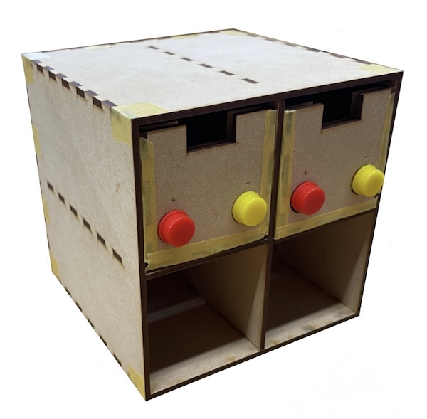
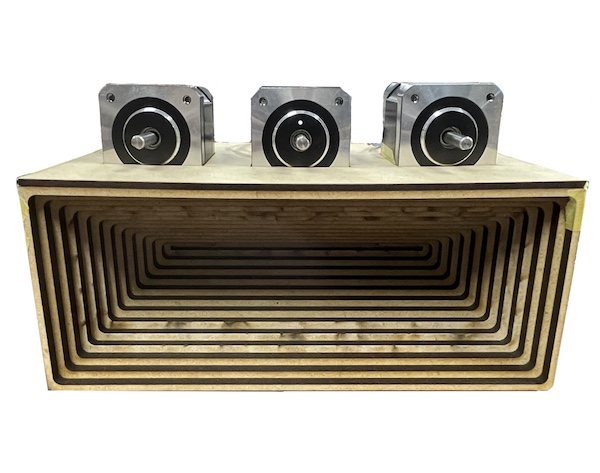

## Prototype

  
<a href="prototype/project1.html">Prototype1</a>

  
<a href="prototype/project2.html">Prototype2</a>
 
  
<a href="prototype/project3.html">Prototype3</a>

  
<a href="projects/project1.html">Prototype4</a>

  
<a href="projects/project1.html">Prototype5</a>
 
  
<a href="projects/project1.html">Prototype6</a>

  
<a href="projects/project1.html">Prototype7</a>

  
<a href="projects/project1.html">Prototype8</a>
 
  
<a href="projects/project1.html">Prototype9</a>
 

## App

  
<a href="app/project1.html">App1</a>

  
<a href="projects/project1.html">Prototype2</a>
 
  
<a href="projects/project1.html">Prototype3</a>

  
<a href="projects/project1.html">Prototype4</a>

  
<a href="projects/project1.html">Prototype5</a>
 
  
<a href="projects/project1.html">Prototype6</a>

  
<a href="projects/project1.html">Prototype7</a>

  
<a href="projects/project1.html">Prototype8</a>
 
  
<a href="projects/project1.html">Prototype9</a>
 

